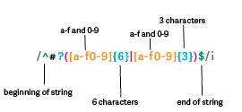

# Hexplained - A Regex Tutorial On Matching A Hex

Matching a hex value using regular expressions is a powerful tool in programming and this tutorial will help you understand the concept. 

A regular expression (shortened as regex), is a sequence of characters that specifies a match pattern in text. In other words, they're patterns used to identify or match character combinations in strings. Matching a hex value using regex can be useful in many applications, such as validating input, parsing data, and searching for specific patterns. 

Now to clarify, a hexadecimal is a base-16 numbering system that uses 16 unique digits to represent numbers. It's commonly used to represent binary-coded values in a human-friendly way. Hex values are often used to define colors, memory locations, and other data types in programming.

## Summary

To demostrate how to use a regular expression to match hex values we will use an example and look at all the components of the regex in detail.  
The following is the regular expression we will use to match a hex value in this tutorial:  

/^#?([a-f0-9]{6}|[a-f0-9]{3})$/i

## Table of Contents

- [Anchors](#anchors)
- [Quantifiers](#quantifiers)
- [OR Operator](#or-operator)
- [Character Classes](#character-classes)
- [Flags](#flags)
- [Grouping and Capturing](#grouping-and-capturing)
- [Bracket Expressions](#bracket-expressions)
- [Boundaries](#boundaries)

## Regex Components

### Anchors

/^#?([a-f0-9]{6}|[a-f0-9]{3})$/i

Anchors match the starting and ending points of a string or line. 
In our case we have ^ in the beginning and $ in the end.  

In our hex value regex, the ^ anchor is followed by the # character, meaning we are looking for # to be the first character of our string but because it is followed the ? (a quantifier explained below), we know that the question mark tells the parser that the preceding character is optional, but to capture it if it's there.  We'll explain that a little further down. 
 
 Another anchor is $, which signifies that the string ends with the characters that precede it. In our hex value regex, we have an expression encased in parentheses preceding the $ anchor. 
 
 The specifics inside the parentheses are the quantifiers and are explained next, but for now we can tell that the string ends with either 6 or 3 characters, of which are lowercase letters a-f or numbers 0-9.

### Quantifiers

/^#?([a-f0-9]{6} | [a-f0-9]{3})$/i

Quantifiers specify how many times a character or group should be matched. In our hex value regex, there are two quatifiers:

1.  ? - this quantifier is interpreted as a boolean meaning it will make the preceding character optional.  In our case the ? tells the parser that the # is optional but to capture it if it's there or true.  

2.  {} - the curly brackets are the other quantifier in our case.  Inside the first group (group of parentheses), we can have two different situations. The first is any lowercase letter between a and f or a number between 0-9 six times. The | (which is the OR Operator explained below) tells us that we can also have three lowercase letters between a and f or numbers between 0-9 instead.  

### OR Operator
/^#?( [a-f0-9]{6} | [a-f0-9]{3})$/i

The OR Operator is interpreted as a boolean for the expression before or after it.  
In our case the | is the OR Oreprator and it tells us that we can have six of any lowercase letter between a and f or a number between 0-9 OR three lowercase letters between a and f or numbers instead.

### Character Classes
/^#?( [a-f0-9]{6} | [a-f0-9]{3})$/i

Character classes match a set of characters, such as digits or letters. 
For example:
A single character: matches the character itself.
A range of characters: matches any character in the inclusive range. The range is specified by two characters separated by a dash (-). The first character must be smaller in character value than the second character. The character value is the Unicode code point of the character. Because Unicode code points are usually assigned to alphabets in order, [a-z] specifies all lowercase Latin characters. 

In our hex value regex, we use the [a-f0-9] character class to match any lowercase letter a-f or any digit 0-9.

### Flags
/^#?( [a-f0-9]{6} | [a-f0-9]{3})$/i

Flags are used to specify additional options that modify the behavior of regular expressions. They can be placed at the end of any regex pattern.

In our case we are using the i flag at the end of our expression.  This is the case insensitive class and allows us to match either #ffffff or #FFFFFF.  

### Grouping and Capturing
/^#?( [a-f0-9]{6} | [a-f0-9]{3})$/i

Grouping and capturing are used to extract parts of a regular expression match. 

In this case, we can use grouping to match either three or six hexadecimal digits.  In our case, the parentheses around the two alternatives create a capturing group that matches either three or six hexadecimal digits.  

It's good to note that we put the six characters before the three characters because otherwise the parser can capture a hex value such as #ffffff, if we had reversed it so that the three characters came first, the parser would only pick up #fff and not the other three 'f's.

### Bracket Expressions
/^#?( [a-f0-9]{6} | [a-f0-9]{3})$/i

Bracket expressions are used to match a single character from a set of characters. In our case our bracket expressions can match letters a-f and numbers 0-9 regardless of case.  Notice our set of characters are within the brackets. 

### Boundaries
/^#?( [a-f0-9]{6} | [a-f0-9]{3})$/i

Boundaries are used to match a word boundary or the beginning or end of a string.  In our case the ^ anchor matches the beginning of the string, and the $ anchor matches the end of the string.

## Author
Sharareh Golshani 
GitHub: https://github.com/Sharareh18